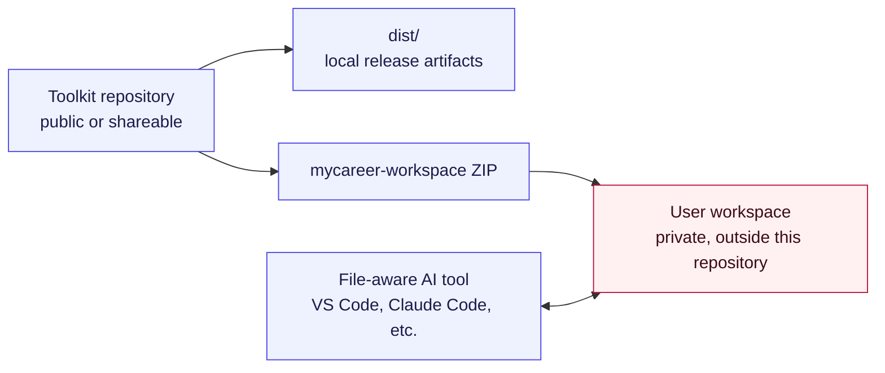
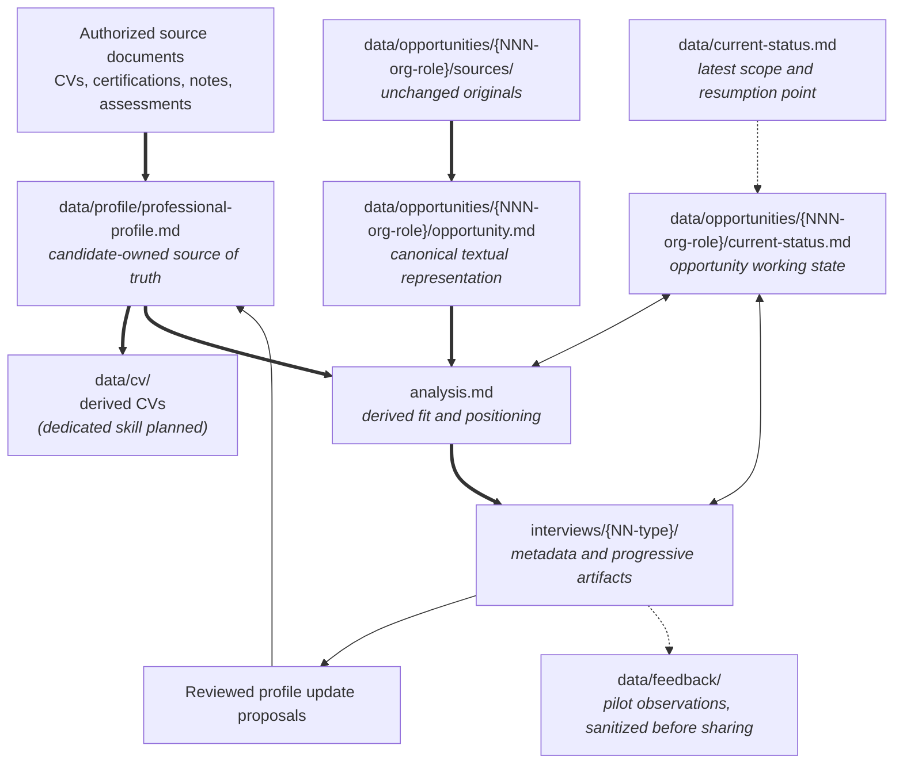

# Architecture

Career AI Toolkit is the generic project and repository. Its main product is MyCareer Workspace: a personal, persistent and local career workspace built around a living professional profile that the user owns and validates. AI is the means (analysis, synthesis, coaching), not the value proposition. The structuring principles are user data ownership and control, privacy, persistence and continuity, portability, transparency and traceability, and user validation of what is capitalized.

The toolkit separates generic, publishable assets from private user data.

- `workspace/`: generic workspace template distributed as a ZIP.
- `test-kit/`: fictional sources (Markdown references and their generated PDF,
  DOCX and TXT), the master scenario and the tools that produce them. Packaged
  by the build as a separate demo and manual-test ZIP, never in the workspace
  ZIP.
- `examples/`: illustrative `data/` tree of a fictional workspace, copied on
  request from a test run of the master scenario.
- `docs/`: product and pilot documentation.
- `dist/`: local, untracked build output.

A user's extracted workspace must live outside this repository. The candidate's source of truth is `data/profile/professional-profile.md`; CVs and opportunity documents are derived views. The workspace and its status files provide durable continuity between temporary coaching conversations.

## Repository boundaries



The toolkit repository contains only reusable instructions, templates,
documentation and fictional examples. Real resumes, notes, job descriptions,
interview feedback and generated candidate documents belong only in the
private user workspace.

## Workspace tree

The distributed ZIP contains the engine and, under `data/`, only `README.md` files. Mandatory working files are created from `skills/init-workspace/assets/` on first use and never overwritten. Entries marked
as coach-created below appear progressively in a private user workspace; they
are not pre-populated in the toolkit artifact.

```text
mycareer-workspace/
|-- AGENTS.md
|-- CLAUDE.md
|-- ENGINE-VERSION                         # engine version, generated by the build from VERSION
|-- README.md
|-- README.fr.md
|-- skills/                                # engine: replaceable
|   |-- README.md
|   |-- init-workspace/
|   |   |-- SKILL.md
|   |   `-- assets/
|   |       |-- current-status.template.md
|   |       |-- external-references.template.md
|   |       |-- pilot-feedback.template.md
|   |       |-- professional-profile.template.md
|   |       `-- workspace.template.yaml
|   `-- interview-coach/
|       |-- SKILL.md
|       |-- assets/
|       |   |-- cover-letter.template.md
|       |   |-- interview.template.md
|       |   |-- interview-feedback.template.md
|       |   |-- interview-preparation-sheet.template.md
|       |   |-- opportunity.template.md
|       |   |-- opportunity-analysis.template.md
|       |   |-- opportunity-current-status.template.md
|       |   `-- simulation-debrief.template.md
|       `-- references/
|           |-- interview-preparation-sheet-guidelines.md
|           |-- interview-simulation-guidelines.md
|           |-- opportunity-structure-guidelines.md
|           |-- professional-profile-guidelines.md
|           |-- profile-update-guidelines.md
|           `-- simulation-debrief-guidelines.md
`-- data/                                  # user data: only README.md in the ZIP
    |-- README.md
    |-- current-status.md                  # coach-created on first use
    |-- config/
    |   |-- README.md
    |   `-- workspace.yaml                 # coach-created on first use
    |-- profile/
    |   |-- README.md
    |   |-- professional-profile.md        # coach-created on first use
    |   `-- sources/
    |       |-- README.md
    |       |-- external-references.md     # coach-created on first use
    |       |-- certifications/
    |       |-- coaching-notes/
    |       |-- evaluations/
    |       |-- historical-resumes/
    |       |-- portfolios/
    |       |-- recommendations/
    |       `-- skills-assessments/
    |-- cv/
    |   `-- README.md
    |-- opportunities/
    |   |-- README.md
    |   `-- 001-organization-role/         # coach-created
    |       |-- current-status.md
    |       |-- opportunity.md
    |       |-- analysis.md                # when analysis starts
    |       |-- sources/                   # originals and their transcriptions
    |       `-- interviews/                # from the first known round
    |           `-- 01-screening/
    |               |-- interview.md
    |               |-- preparation.md     # when generated
    |               |-- simulations/       # from the first simulation
    |               |   `-- 01/
    |               |       |-- transcript.md  # when available
    |               |       `-- debrief.md
    |               `-- actual/            # when the real interview is documented
    |                   |-- notes.md       # when available
    |                   |-- transcript.md  # optional
    |                   `-- review.md
    |-- archives/
    |   `-- README.md
    `-- feedback/
        |-- README.md
        `-- pilot-feedback.md              # optional, created on request
```

Only `current-status.md`, `opportunity.md` and, once analysis starts,
`analysis.md` are opportunity-level working files. Each interview owns its
metadata, preparation, simulations and actual-interview artifacts. Optional or
phase-specific directories are created only when needed.

## Workspace document model



The professional profile is the stable base. Derived documents may be edited
for clarity and format, but new facts should be added to source documents or
the professional profile before regenerated output depends on them.

Status files are compact working-memory snapshots, not historical logs or new
sources of candidate facts. Detailed evidence and history remain in the
profile, authorized sources and dedicated opportunity artifacts.

The coach creates opportunity and interview directories progressively. Stable
numeric prefixes preserve creation order; Markdown identity files preserve the
business meaning independently from directory names.

## Related documentation

- [French/English business glossary](glossary.md)
- [Workflow design reference](design/01-career-ai-toolkit-workflow-design.md)
- [Design decision log](design/decision-log.md)
- [Use cases](use-cases.md)
- [Document lifecycle](document-lifecycle.md)
- [MyCareer Workspace user guide](../workspace/USER-GUIDE.md)
- [Professional profile](professional-profile.md)
