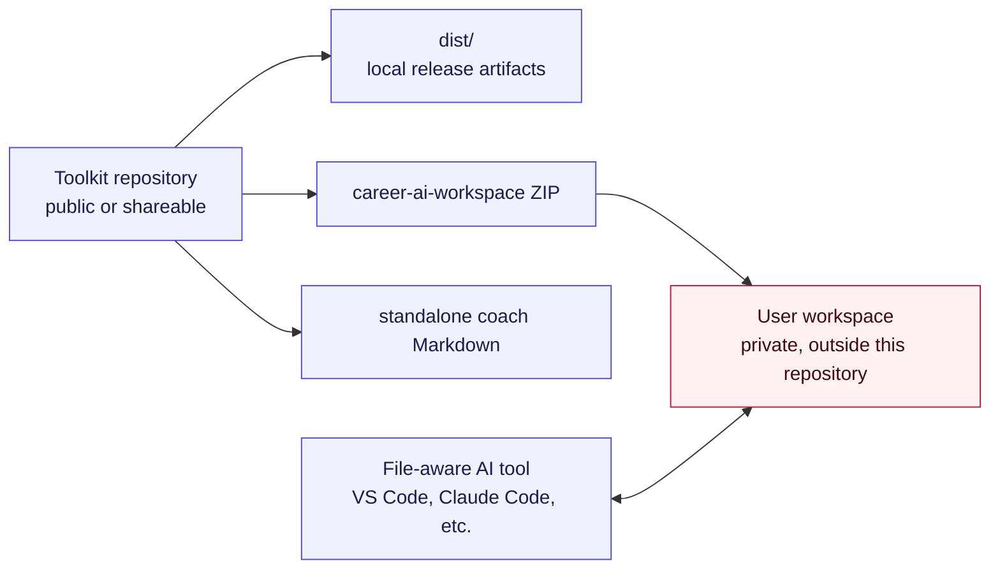
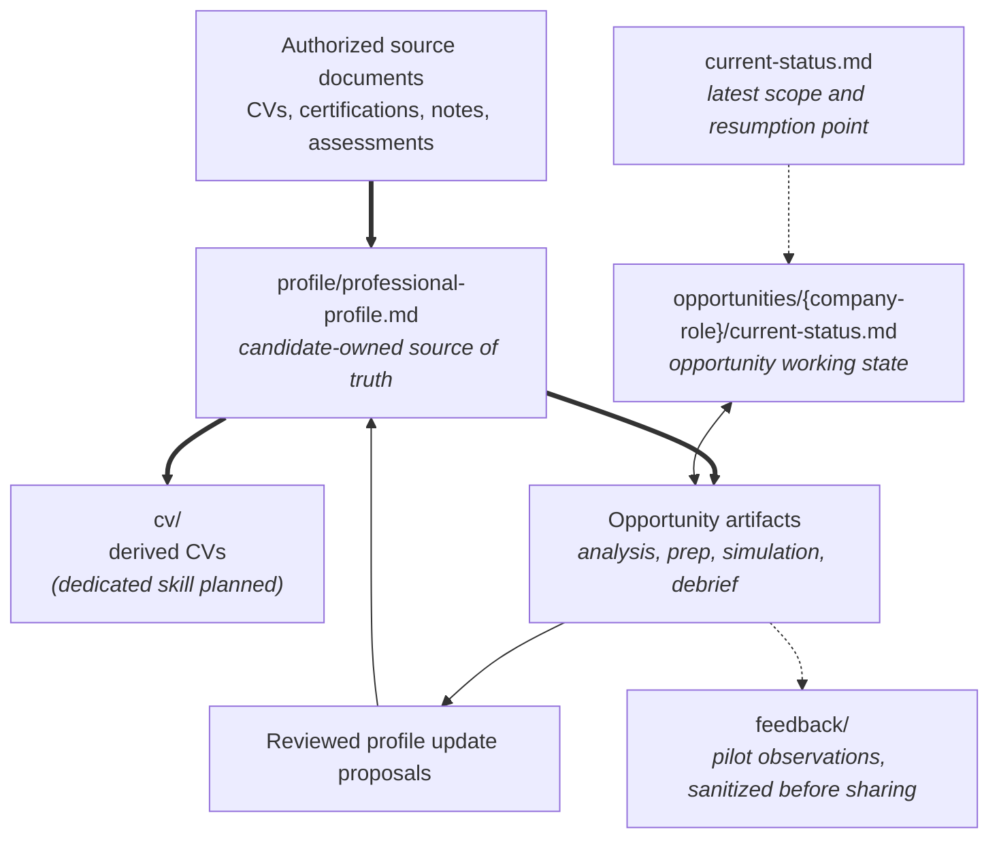

# Architecture

Career AI Toolkit separates generic, publishable assets from private user data.

- `standalone/`: portable assistant instructions.
- `workspace/`: generic workspace template distributed as a ZIP.
- `examples/`: synthetic end-to-end demonstration.
- `docs/`: product and pilot documentation.
- `dist/`: local, untracked build output.

A user's extracted workspace must live outside this repository. The candidate's source of truth is `profile/professional-profile.md`; CVs and opportunity documents are derived views. The workspace and its status files provide durable continuity between temporary coaching conversations.

## Repository boundaries

The toolkit repository contains only reusable instructions, templates,
documentation and fictional examples. Real resumes, notes, job descriptions,
interview feedback and generated candidate documents belong only in the
private user workspace.

## Workspace document model

The professional profile is the stable base. Derived documents may be edited
for clarity and format, but new facts should be added to source documents or
the professional profile before regenerated output depends on them.

Status files are compact working-memory snapshots, not historical logs or new
sources of candidate facts. Detailed evidence and history remain in the
profile, authorized sources and dedicated opportunity artifacts.

## Related documentation

- [Use cases](use-cases.md)
- [Document lifecycle](document-lifecycle.md)
- [Workspace mode](workspace-mode.md)
- [Professional profile](professional-profile.md)
