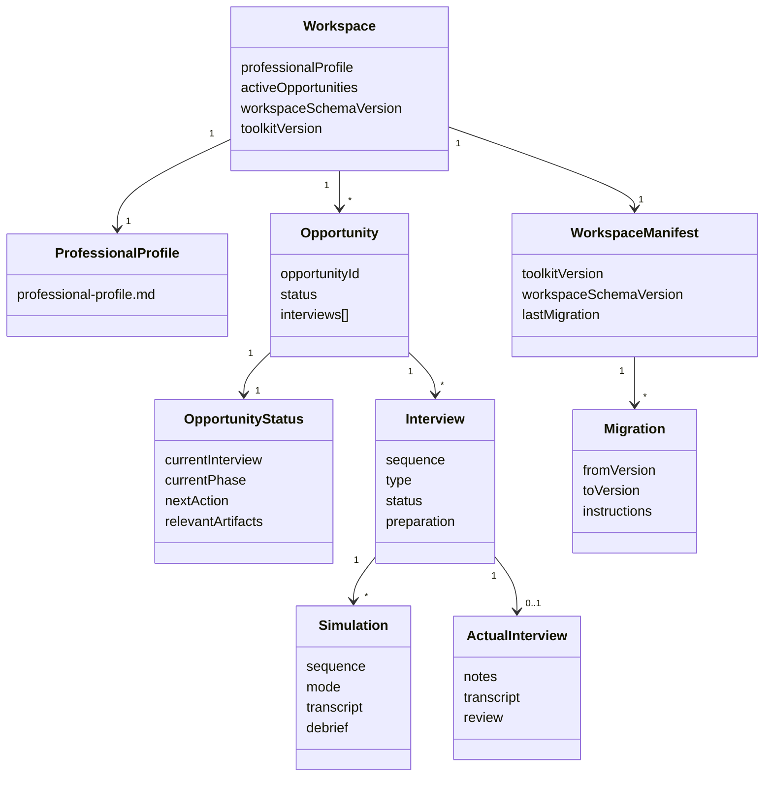

# Career AI Toolkit — Notes de conception consolidées (v3)

## Statut de ce document

Cette note consolide les décisions et pistes d’évolution identifiées lors de discussions de conception autour de **career-ai-toolkit**.

Elle est destinée à être reprise ensuite dans une session de conception avec un agent ayant accès au **vrai repository**, afin de :

- confronter ces idées à l’architecture existante ;
- corriger les hypothèses inexactes ;
- adapter les noms et emplacements à la structure réelle ;
- minimiser les changements inutiles ;
- produire les diagrammes et migrations correspondant au modèle réel.

> Les arborescences, noms de fichiers et diagrammes ci-dessous sont **conceptuels**. Ils ne doivent pas être appliqués mécaniquement sans comparaison avec le repository existant.

---

# 1. Principes architecturaux

## 1.1 Workspace-first continuity

Le workspace doit porter la continuité du travail.

Une conversation avec un agent est une mémoire volatile utile pendant une session, mais le workflow ne doit pas devenir inutilisable si :

- la conversation est fermée ;
- l’utilisateur change d’outil ou d’interface ;
- le modèle change ;
- le travail reprend plusieurs jours plus tard ;
- une autre instance d’agent reprend le dossier.

Principe :

> Toute étape importante doit pouvoir être reconstruite à partir du workspace, sans dépendre de l’historique de conversation.

---

## 1.2 `professional-profile.md` reste la source de vérité du profil professionnel

Le profil professionnel est initialisé à partir des sources fournies par l’utilisateur.

Après cette initialisation :

- le coach peut détecter de nouvelles informations pertinentes ;
- il peut proposer des amendements ;
- ces amendements sont soumis à validation ;
- aucune inférence ou reformulation ne doit devenir silencieusement une vérité du profil.

Principe :

> Le candidat garde le contrôle explicite sur son profil de référence.

---

# 2. Modèle métier à formaliser

Une évolution importante consiste à formaliser davantage le modèle conceptuel du toolkit.

Le repository devrait disposer, dans sa section de conception, d’un **modèle de données / modèle métier** accompagné d’un diagramme de classes UML (Mermaid peut suffire si cohérent avec les outils actuels du projet).

Le diagramme définitif doit être produit à partir de l’architecture réelle du repository.

## 2.1 Modèle conceptuel provisoire

Les entités importantes semblent être au minimum :

- Workspace
- ProfessionalProfile
- Opportunity
- Interview
- Simulation
- RealInterview / ActualInterview
- Preparation
- Debrief / Review
- OpportunityStatus
- Toolkit / Workspace manifest
- Migration

Relations principales :

- un Workspace contient un ProfessionalProfile ;
- un Workspace contient plusieurs Opportunities ;
- une Opportunity contient plusieurs Interviews ordonnés ;
- un Interview peut avoir plusieurs Simulations ;
- un Interview correspond normalement à zéro ou un entretien réel ;
- une Simulation produit éventuellement une transcription et un debrief ;
- un entretien réel peut produire des notes/transcription et une review ;
- une Opportunity possède un état courant persistant ;
- le Workspace porte une version de schéma compatible avec une version du toolkit.

## 2.2 Diagramme conceptuel provisoire

À adapter avec le vrai modèle :



Ce diagramme est une base de discussion, pas le modèle définitif.

---

# 3. Structure d’une opportunité et des entretiens

## 3.1 Entretiens ordonnés explicitement

Chaque opportunité doit pouvoir conserver plusieurs entretiens / rounds dans leur ordre réel.

Une convention de répertoire du type :

```text
01-screening
02-manager
03-technical
04-hr
```

est intéressante car elle :

- rend l’ordre humainement visible ;
- stabilise la navigation ;
- facilite les références dans le status ;
- permet de revenir sur les étapes précédentes.

Le nom du dossier ne doit toutefois pas être la seule source de sémantique. Les informations importantes sur l’entretien doivent également exister dans un artefact métier du round si le modèle actuel le prévoit.

---

## 3.2 Plusieurs simulations pour un même entretien

Un même entretien cible peut donner lieu à plusieurs simulations.

Conceptuellement :

```text
<interview>/
    preparation...
    simulations/
        01/
            transcript.md
            debrief.md
        02/
            transcript.md
            debrief.md
        03/
            transcript.md
            debrief.md
```

L’arborescence exacte doit être adaptée au repository.

Les simulations peuvent différer par :

- modalité textuelle ;
- dictée/transcription ;
- Voice/live ;
- objectif spécifique ;
- focus sur certains points faibles ;
- niveau de difficulté.

Le debrief doit être propre à chaque simulation.

---

## 3.3 Un entretien réel par round

Conceptuellement, un round d’entretien correspond normalement à :

- plusieurs simulations possibles ;
- zéro ou un entretien réel.

L’entretien réel peut ensuite être revisité pour en tirer des enseignements.

Artefacts possibles, à adapter :

```text
actual/
    notes.md
    transcript.md      # seulement si disponible et légitime
    review.md
```

L’absence de transcription réelle ne doit pas bloquer la review : des notes prises après l’entretien doivent suffire.

---

# 4. `current-status.md` par opportunité

## 4.1 Rôle

Chaque opportunité devrait disposer d’un fichier d’état persistant, conceptuellement nommé :

`current-status.md`

Il joue le rôle de :

> working memory persistante / cache sur disque de l’état utile de l’agent pour cette opportunité.

Il doit notamment permettre de retrouver :

- l’état de l’opportunité ;
- l’entretien actuellement travaillé ;
- la phase courante ;
- les décisions importantes déjà validées ;
- les artefacts récents utiles ;
- les résultats ou enseignements à conserver en contexte ;
- la prochaine action.

Exemple conceptuel :

```md
# Current status

Opportunity state: active

Current interview:
- 02-manager

Current phase:
- interview preparation

Completed:
- opportunity analysis
- positioning validation
- simulation 01
- debrief 01

Current focus:
- leadership examples
- architecture trade-offs

Relevant artifacts:
- latest preparation
- simulation 01 transcript
- simulation 01 debrief

Next action:
- run simulation 02
```

---

## 4.2 Le status n’est pas un journal

Le fichier doit rester :

- compact ;
- lisible ;
- orienté action ;
- représentatif de l’état actuel.

Séparation :

- conversation = mémoire volatile ;
- `current-status.md` = working memory persistante ;
- transcriptions / debriefs / reviews = mémoire longue durée et historique.

---

## 4.3 Responsabilité explicite des skills

Les skills concernés doivent mentionner explicitement la responsabilité de maintenir ce status.

Mise à jour obligatoire au minimum :

- changement d’étape du workflow ;
- changement d’entretien courant ;
- validation importante ;
- fin d’une simulation ;
- fin d’un debrief ;
- préparation d’un nouveau round ;
- changement de prochaine action.

Mise à jour opportuniste :

- dès qu’une information importante doit survivre à la conversation.

---

## 4.4 Exception pendant une simulation

Pendant une simulation, éviter les écritures permanentes qui pourraient casser le rythme ou introduire un comportement non réaliste.

Pattern souhaité :

1. checkpoint avant simulation ;
2. simulation sans coaching et sans maintenance constante du workspace ;
3. capture des artefacts à la fin ;
4. mise à jour du status ;
5. passage au debrief.

---

# 5. Sessions de travail et plusieurs opportunités actives

Le candidat peut travailler sur plusieurs entreprises / opportunités au même moment.

Le toolkit ne doit donc jamais supposer qu’une seule opportunité est active, ni qu’une conversation doit rester attachée à une opportunité unique pendant toute sa durée de vie.

## 5.1 Une conversation = une session de travail

Une conversation avec le coach doit être considérée comme une **session de travail temporaire**.

Le contexte durable est fourni par le workspace ; la conversation sert à accomplir un objectif courant.

Au début d’une nouvelle session, le coach doit identifier explicitement avec le candidat le scope de travail, par exemple :

- dossier professionnel général ;
- une opportunité précise ;
- un entretien spécifique ;
- CV ;
- profil LinkedIn ;
- nouvelle opportunité ;
- autre tâche transverse.

Le coach peut aussi clarifier le résultat attendu de la session lorsque cela apporte une vraie valeur, sans imposer un rituel lourd.

Cette approche permet :

- de garder les conversations relativement courtes ;
- de limiter l’accumulation de contexte inutile ;
- de reprendre facilement dans une nouvelle conversation ;
- de faire reposer la continuité sur la memory-on-disk du `career-workspace`.

Principe :

> Une conversation est une session de travail. Le workspace porte l’histoire et l’état durable.

## 5.2 Sélection du scope

Si le candidat indique clairement le scope, l’agent le sélectionne directement.

Si le candidat dit simplement « on reprend où on s’était arrêté », le coach peut utiliser le dernier scope mémorisé au niveau global pour proposer une reprise fluide.

Si plusieurs scopes sont plausibles ou si l’utilisateur souhaite changer de sujet, le coach doit convenir explicitement du nouveau scope plutôt que choisir silencieusement.

Exemples :

- « on reprend où on s’était arrêté » ;
- « mets en pause ce qu’on faisait, je veux travailler sur mon CV » ;
- « revenons à l’opportunité X » ;
- « je viens d’avoir un nouvel entretien pour Y ».

## 5.3 `current-status.md` global du workspace

Un `current-status.md` global au workspace est pertinent, à condition qu’il reste **minimal**.

Il peut contenir notamment :

- le dernier scope utilisé ;
- le dernier type de tâche ;
- éventuellement le point de reprise général ;
- une courte indication permettant de router la prochaine session.

Il ne doit pas maintenir une copie de la liste des opportunités actives ni du détail de leur état.

Principe :

> Le status global aide à reprendre une session ; les status d’opportunité restent responsables de leur propre domaine.

## 5.4 Opportunités actives déduites des opportunités elles-mêmes

Les opportunités actives doivent être déterminées à partir de leurs propres répertoires et `current-status.md`.

Cela évite :

- duplication d’information ;
- divergence entre un index global et les opportunités ;
- violation de l’encapsulation des domaines.

Le workspace global peut découvrir les opportunités et lire leur status lorsque nécessaire.

## 5.5 Opportunités ordonnées par création

Les répertoires d’opportunité devraient utiliser un préfixe séquentiel stable, par exemple :

```text
01-company-role-a
02-company-role-b
03-company-role-c
```

Cette convention facilite :

- la navigation humaine ;
- l’ordre chronologique de création ;
- les références par l’agent.

De la même façon, les entretiens d’une opportunité peuvent rester ordonnés :

```text
01-screening
02-manager
03-technical
```

## 5.6 Indépendance des opportunités

Chaque opportunité doit être traitée comme une entité indépendante, y compris lorsque plusieurs opportunités concernent la même entreprise.

Il n’est pas nécessaire d’introduire un niveau métier `Company` uniquement pour regrouper ces opportunités.

Cette simplicité évite un niveau de modèle supplémentaire.

Si une analyse transversale est utile, l’agent peut toujours rechercher les autres opportunités portant sur la même entreprise.

---

# 6. Simulation d’entretien

## 6.1 Réalisme avant coaching

La simulation doit être distincte de la phase de coaching.

Pendant l’entretien simulé :

- une question à la fois ;
- pas de feedback pédagogique entre les réponses ;
- pas de correction immédiate ;
- comportement cohérent avec le type d’interviewer ;
- relances naturelles ;
- adaptation à ce que dit le candidat ;
- proximité maximale avec un véritable entretien.

Le coaching reprend uniquement pendant le debrief.

---

## 6.2 Modalités interchangeables

La simulation doit être conçue indépendamment d’un produit ou fournisseur spécifique.

Modalités possibles :

```text
simulate
├── text
├── dictation / transcription
└── live voice
```

Le workflow métier reste identique.

Le skill doit décrire le comportement attendu, pas dépendre d’une marque ou d’une interface particulière.

---

## 6.3 Conservation de la simulation

Lorsque techniquement possible, conserver une transcription brute comme artefact.

Séparer :

- `transcript.md` = ce qui s’est passé ;
- `debrief.md` = analyse ;
- préparation consolidée = ce que le candidat doit réutiliser ensuite.

Principe :

> Ne pas mélanger événement, interprétation et connaissance consolidée.

---

# 7. Debrief indépendant de la conversation de simulation

Le debrief doit pouvoir fonctionner sans l’historique du chat de simulation.

Il doit s’appuyer sur les artefacts persistants pertinents :

- `professional-profile.md` ;
- opportunity ;
- interview courant ;
- préparation ;
- transcript / notes de simulation ;
- status de l’opportunité ;
- éventuellement résultats d’étapes antérieures utiles.

Cela permet de debriefer :

- une simulation texte ;
- une simulation Voice ;
- une simulation avec un humain ;
- un entretien réel ;
- une transcription importée depuis un autre outil.

---

# 8. Niveaux de raisonnement indépendants des modèles

Les documents destinés aux utilisateurs ne doivent pas lier le toolkit à un modèle spécifique ou à un fournisseur précis.

Éviter dans les instructions génériques des prescriptions comme :

- utiliser tel modèle ;
- ouvrir tel produit ;
- choisir une option propre à un fournisseur.

Préférer des niveaux de besoin cognitifs génériques :

- **low** : transformation simple, formatage, extraction, tâches très guidées ;
- **medium** : coaching courant, analyse d’opportunité, préparation, debrief standard ;
- **high** : stratégie complexe, ambiguïtés, analyse approfondie, arbitrages difficiles, conception du toolkit.

Règle utilisateur :

> Commencer avec le niveau recommandé et augmenter le niveau de raisonnement si la qualité obtenue est insuffisante.

---

## 8.1 Encoder cette information dans les skills

Autant que possible, la complexité attendue doit être déclarée dans les skills eux-mêmes.

Par exemple, un skill peut indiquer :

```text
recommended_reasoning: medium
```

ou une convention équivalente adaptée au toolkit.

Attention :

- tous les runtimes ne permettent pas à un skill de changer dynamiquement le niveau de reasoning ;
- cette indication doit donc être considérée comme une **exigence/recommandation de capacité** ;
- un launcher ou runtime compatible peut l’appliquer automatiquement ;
- sinon l’agent peut informer l’utilisateur seulement si le niveau actuel paraît insuffisant.

Le toolkit ne doit pas supposer une implémentation spécifique.

---


# 9. Sources documentaires et représentation textuelle canonique

## 9.1 Principe à discuter : privilégier les fichiers texte exploitables nativement

Le workspace métier devrait autant que possible stocker ses informations actives sous une forme texte directement exploitable par l’agent, typiquement Markdown.

Objectifs :

- lecture simple et fiable ;
- diff Git compréhensible ;
- portabilité entre agents et fournisseurs ;
- absence de dépendance à un parser propriétaire ;
- modification contrôlable ;
- facilité de migration.

Principe candidat :

> Les artefacts métier utilisés par le coach devraient avoir une représentation texte canonique dans le workspace.

## 9.2 Gestion des fichiers source non textuels

Les documents originaux fournis par l’utilisateur (`pdf`, `docx`, etc.) peuvent éventuellement être conservés dans un sous-répertoire `sources/` ou équivalent.

Ces fichiers :

- constituent des sources originales ;
- ne doivent pas être modifiés par le coach ;
- peuvent être conservés pour traçabilité.

Lors de l’import ou de la mise à jour d’une opportunité, leur contenu utile devrait être converti en une représentation Markdown exploitable par les skills.

Exemple conceptuel :

```text
opportunity/
    sources/
        original-job-description.pdf
    opportunity.md
```

Le nom exact et la localisation sont à adapter.

## 9.3 Source originale versus représentation de travail

Il faut distinguer :

- **source originale** : document fourni par l’utilisateur, immuable ;
- **représentation textuelle canonique** : contenu converti et utilisé par le toolkit ;
- **analyse dérivée** : positionnement, préparation, notes, etc.

Cette séparation facilite l’audit et évite qu’un fichier binaire externe devienne implicitement la seule source exploitable du modèle.

---

# 10. Import rétroactif d’entretiens existants — backlog

Fonctionnalité à garder dans le backlog après validation du workflow principal.

Objectif :

> Permettre à un utilisateur d’importer des données liées à des entretiens réalisés avant l’utilisation du toolkit et de reconstruire, autant que raisonnablement possible, le modèle de données comme s’il avait utilisé le toolkit dès le début.

Sources possibles :

- notes personnelles ;
- emails ;
- annonces archivées ;
- invitations ;
- transcriptions ;
- documents de préparation ;
- souvenirs structurés avec le coach.

L’import devrait tenter de reconstruire :

- l’opportunité ;
- les rounds d’entretien ;
- leur ordre ;
- les simulations éventuelles si connues ;
- l’entretien réel ;
- la review / les enseignements ;
- les mises à jour potentielles du profil.

## 10.1 Prudence sur les données reconstruites

Le toolkit doit distinguer :

- information directement issue d’une source ;
- information fournie rétrospectivement par l’utilisateur ;
- information inférée par le coach ;
- information inconnue.

Il ne faut pas fabriquer une précision historique inexistante uniquement pour satisfaire le modèle.

Principe :

> Reconstruct as much as possible, but preserve uncertainty.

## 10.2 Valeur de cette fonctionnalité

Cette fonctionnalité permettrait :

- d’éviter une rupture entre le passé professionnel et le démarrage du toolkit ;
- de capitaliser immédiatement sur des expériences récentes ;
- d’amorcer le modèle d’opportunités et d’entretiens avec un historique utile ;
- de rendre les analyses longitudinales plus pertinentes.

Elle doit cependant rester secondaire tant que le workflow nominal n’a pas été validé de bout en bout.

---

# 11. Version du toolkit et compatibilité du workspace

C’est un nouveau sujet architectural important.

Les données personnelles du workspace ont une durée de vie potentiellement beaucoup plus longue que les versions du toolkit.

Il faut donc prévoir explicitement :

- la version du toolkit ;
- la version du modèle de données / schéma du workspace ;
- les migrations nécessaires.

---

## 9.1 Distinguer version du toolkit et version du workspace

Ces deux notions ne sont pas identiques.

### Toolkit version

Version des :

- skills ;
- templates ;
- instructions ;
- documentation ;
- comportements.

Une nouvelle version du toolkit peut ne nécessiter aucune migration de données.

### Workspace schema version

Version de la structure attendue pour les données personnelles :

- organisation des opportunités ;
- organisation des interviews ;
- noms / rôles des fichiers ;
- nouvelles métadonnées obligatoires ;
- changement de format sémantique.

Une évolution de ce schéma peut nécessiter une migration.

Principe :

> Ne pas forcer une migration des données pour une simple mise à jour de skill qui ne modifie pas le modèle de données.

---

## 9.2 Manifest du workspace

Prévoir à la racine du workspace un petit fichier stable et facilement lisible par l’agent.

Nom à décider selon les conventions réelles, par exemple :

```text
workspace-manifest.md
```

Contenu conceptuel :

```md
# Workspace manifest

Toolkit version: 0.6.0
Workspace schema version: 2
Last migration: 1 -> 2
```

Le format définitif doit être suffisamment déterministe pour être lu par un agent sans ambiguïté.

Il peut rester en Markdown si cela correspond à la philosophie du projet.

---

# 12. Migrations

## 10.1 Instructions de migration versionnées

Le toolkit devrait contenir des instructions de migration explicites lorsque le schéma du workspace évolue.

Exemple conceptuel :

```text
migrations/
    workspace-v1-to-v2.md
    workspace-v2-to-v3.md
```

Chaque migration devrait définir :

- version source ;
- version cible ;
- préconditions ;
- fichiers concernés ;
- transformations ;
- invariants à préserver ;
- contrôles post-migration ;
- éventuelles actions manuelles ;
- comportement en cas d’ambiguïté.

---

## 10.2 Migrations séquentielles

Un workspace ancien doit pouvoir être migré progressivement :

```text
v1 -> v2 -> v3 -> v4
```

plutôt qu’exiger une migration spécifique pour chaque couple de versions.

Cela réduit la complexité de maintenance.

---

## 10.3 Protection des données

Une migration ne doit pas risquer de détruire silencieusement le dossier professionnel de l’utilisateur.

Avant une migration potentiellement destructive :

- préserver une sauvegarde ou un snapshot adapté au mode de distribution ;
- éviter d’écraser une information non comprise ;
- demander validation lorsque la transformation est ambiguë ;
- vérifier les invariants après migration ;
- ne mettre à jour le numéro de version qu’après succès.

L’implémentation précise dépendra de l’usage ou non de Git dans le workspace utilisateur.

---

## 10.4 Idempotence et reprise

Lorsque possible, les migrations doivent être conçues pour :

- détecter si elles ont déjà été appliquées ;
- éviter les doublons ;
- pouvoir reprendre après interruption ;
- laisser le workspace dans un état explicite si la migration n’est pas terminée.

---

# 13. Bootstrap / reprise d’un workspace

Lorsqu’un agent ouvre un workspace existant, le processus idéal pourrait être :

1. lire les instructions racine du toolkit ;
2. lire le manifest du workspace ;
3. vérifier la compatibilité toolkit / workspace schema ;
4. appliquer ou proposer les migrations nécessaires ;
5. identifier le scope de travail :
   - profil général ;
   - opportunité ;
   - entretien ;
   - tâche transverse ;
6. si une opportunité est sélectionnée, lire son `current-status.md` ;
7. reprendre le workflow à partir de l’état persistant.

Ce mécanisme doit être documenté dans le skill ou les instructions d’orchestration appropriées.

---

# 14. Raisonnement par phase

La documentation doit rester générique.

Suggestion de niveau de raisonnement :

| Phase | Niveau recommandé |
|---|---|
| Initialisation / extraction de données structurées | low à medium |
| Analyse d’opportunité | medium |
| Positionnement stratégique | medium, high si complexe |
| Préparation d’entretien | medium |
| Simulation | medium ; priorité au réalisme |
| Debrief | medium |
| Debrief complexe / analyse fine | high |
| Génération / adaptation CV | medium |
| Mise à jour profil | medium |
| Stratégie de transition complexe | high |
| Conception / évolution du toolkit | high |

L’utilisateur peut augmenter le niveau lorsque la qualité obtenue n’est pas suffisante.

---

# 15. Tests de bout en bout à effectuer

Le prochain test réel devrait couvrir au moins :

1. création d’un workspace ;
2. initialisation du profil professionnel ;
3. création de plusieurs opportunités actives ;
4. vérification de la sélection correcte du scope ;
5. création d’une première opportunité ;
6. création de plusieurs entretiens ordonnés ;
7. création de `current-status.md` ;
8. préparation d’un entretien ;
9. simulation 01 ;
10. transcription ;
11. debrief 01 ;
12. amélioration ;
13. simulation 02 ;
14. nouveau debrief ;
15. entretien réel ;
16. review de l’entretien réel ;
17. préparation du round suivant ;
18. proposition éventuelle de mise à jour du profil ;
19. reprise depuis une nouvelle conversation uniquement grâce au workspace ;
20. mise à jour du toolkit ;
21. test d’une migration de workspace simulée.

---

# 16. Tâches de conception à demander à l’agent dans VS Code

Avec accès au vrai repository, demander à l’agent de :

1. analyser le modèle métier déjà implicite dans les skills et templates ;
2. identifier les écarts avec cette note ;
3. proposer un modèle de données canonique minimal ;
4. produire un diagramme UML / Mermaid dans la section conception ;
5. définir la représentation d’un Interview ;
6. définir la représentation des Simulations multiples ;
7. définir la représentation de l’entretien réel ;
8. intégrer un `current-status` par opportunité ;
9. intégrer un `current-status` global minimal pour le dernier scope ;
10. formaliser le concept « une conversation = une session de travail » ;
11. vérifier la gestion de plusieurs opportunités actives ;
12. valider le préfixage séquentiel des opportunités et entretiens ;
13. discuter puis formaliser la politique de sources binaires versus Markdown canonique ;
14. rendre les instructions de reasoning génériques et provider-agnostic ;
15. définir un manifest de workspace ;
16. distinguer toolkit version et workspace schema version ;
17. définir le mécanisme de migration ;
18. prévoir au moins une migration factice ou testable pour valider l’architecture ;
19. inscrire l’import rétroactif d’entretiens existants dans le backlog ;
20. mettre à jour les skills concernés sans restructurer inutilement le projet ;
21. tester le workflow complet.

---

# 17. Principes à préserver

## A. User-owned source of truth

Le profil professionnel reste contrôlé par l’utilisateur.

## B. Workspace-first continuity

Le workspace porte l’état durable.

## C. Conversation is a work session

Une conversation représente une session de travail temporaire et ne doit jamais être indispensable à la reprise.

## D. Opportunity-scoped working memory

Chaque opportunité dispose d’un état courant compact.

## E. Multiple opportunities are first-class

Le système ne suppose pas une seule candidature active.

## F. Interviews are ordered first-class entities

Une opportunité peut contenir plusieurs rounds d’entretien clairement identifiés.

## G. Simulations are repeatable

Un entretien peut avoir plusieurs simulations.

## H. Actual interview is distinct

La simulation et l’entretien réel ne sont pas le même objet.

## I. Event, interpretation and consolidation are separate

Transcription, debrief et préparation consolidée ont des rôles distincts.

## J. Live/Voice is a modality, not a dependency

Le toolkit reste indépendant d’un fournisseur ou produit spécifique.

## K. Reasoning requirements are generic

Décrire le niveau de réflexion attendu plutôt qu’un modèle précis.

## L. Skills encode workflow knowledge

Le maximum de logique doit être porté par les skills, sans imposer des manipulations inutiles à l’utilisateur.

## M. Workspace compatibility is explicit

Le toolkit doit savoir quelle version de données il manipule et comment migrer les versions anciennes.

## N. Domain state is encapsulated

L’état d’une opportunité appartient à l’opportunité ; l’état global ne doit pas dupliquer ses données.

## O. Text is the canonical working format

Les données métier exploitées par le coach doivent autant que possible disposer d’une représentation texte canonique, même si des sources originales binaires sont conservées.

## P. Historical import preserves uncertainty

Un import rétroactif reconstruit ce qui est connu sans inventer les informations manquantes.

---

# 18. Objectif final

Le toolkit doit permettre au candidat de construire progressivement un **dossier professionnel portable, auditable et durable**, puis de l’utiliser pour plusieurs opportunités simultanées.

Chaque opportunité doit conserver sa propre histoire :

```text
Opportunity
    -> interview 01
        -> simulations 01..n
        -> real interview
        -> review
    -> interview 02
        -> simulations 01..n
        -> real interview
        -> review
    -> ...
```

Le coach doit pouvoir revenir sur une opportunité des jours plus tard, comprendre immédiatement où elle en est, puis poursuivre le travail sans dépendre d’une session antérieure.

Enfin, le workspace doit survivre aux évolutions du toolkit grâce à un **versionnement explicite du schéma et à des migrations contrôlées**.
