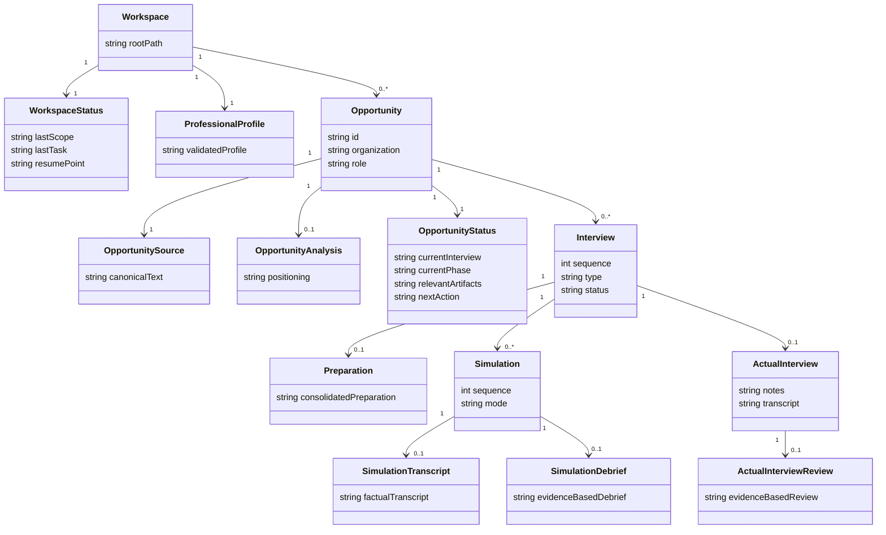

# Career AI Toolkit — Référence de conception du workflow

## Statut

Ce document est la référence de conception du workspace et du coach d'entretien pour le pilote v0.3.

Les instructions, modèles et documentations du repository doivent rester cohérents avec cette référence. Lorsqu'un test réel révèle un écart utile, la décision retenue doit être reportée ici avant ou avec sa mise en œuvre.

Le périmètre actuel couvre :

- le workspace privé et portable ;
- le dossier professionnel ;
- les opportunités et leurs sources ;
- les rounds d'entretien ;
- la préparation, les simulations, les debriefs et les entretiens réels ;
- la continuité entre sessions de coaching.

La compatibilité entre versions, les migrations et les recommandations de reasoning sont volontairement différées après le premier test de bout en bout réel. Les contraintes à préserver pour ces sujets sont consignées en fin de document.

---

# 1. Principes architecturaux

## 1.1 Workspace-first continuity

Le workspace porte la continuité durable du travail. Une conversation est une session temporaire consacrée à un objectif courant.

Toute étape importante doit pouvoir être reconstruite à partir des fichiers du workspace sans dépendre de l'historique d'une conversation.

## 1.2 Contrôle du candidat

`profile/professional-profile.md` est la source de vérité consolidée du profil professionnel.

- Le candidat valide les faits durables et réutilisables.
- Le coach ne modifie jamais silencieusement le profil.
- Les informations propres à une opportunité restent dans son répertoire tant que le candidat ne les a pas validées comme durables.
- Les contradictions et incertitudes restent explicites.

## 1.3 Texte canonique et sources originales

Les artefacts métier utilisés par le coach disposent d'une représentation Markdown lisible, diffable et portable.

Les documents originaux autorisés peuvent être conservés pour traçabilité, sans modification. Ils ne doivent pas devenir l'unique représentation exploitable d'une opportunité.

## 1.4 Création pilotée par le coach

Le candidat fournit les informations et documents disponibles. Le coach crée et maintient les répertoires, fichiers canoniques et artefacts au fur et à mesure du workflow.

Le coach ne crée pas à l'avance une arborescence vide et ne demande pas au candidat d'assurer manuellement la structure technique.

---

# 2. Modèle métier canonique

## 2.1 Entités et représentations

| Entité | Représentation canonique | Responsabilité |
|---|---|---|
| Workspace | répertoire racine | Contient le profil, les opportunités, les skills et l'état de reprise global |
| ProfessionalProfile | `profile/professional-profile.md` | Faits et apprentissages durables validés par le candidat |
| WorkspaceStatus | `current-status.md` | Dernier scope, dernière tâche et point de reprise global |
| Opportunity | `opportunities/NNN-organization-role/` | Domaine autonome d'une candidature |
| OpportunitySource | `opportunity.md` | Représentation textuelle canonique de l'offre et du contexte fourni |
| OpportunityAnalysis | `analysis.md` | Adéquation, écarts, hypothèses, positionnement et messages stratégiques |
| OpportunityStatus | `current-status.md` dans l'opportunité | Mémoire de travail compacte de l'opportunité |
| Interview | `interviews/NN-type/interview.md` | Identité, type, état et informations connues d'un round |
| Preparation | `preparation.md` | Préparation consolidée propre à un round |
| Simulation | `simulations/NN/` | Événement simulé distinct et répétable |
| SimulationTranscript | `simulations/NN/transcript.md` | Trace factuelle de la simulation lorsqu'elle est disponible |
| SimulationDebrief | `simulations/NN/debrief.md` | Analyse d'une simulation déterminée |
| ActualInterview | `actual/` | Entretien réel unique d'un round |
| ActualInterviewReview | `actual/review.md` | Analyse de l'entretien réel à partir des éléments disponibles |

Les opportunités actives sont découvertes depuis leurs répertoires et leurs status. Elles ne sont pas dupliquées dans un index global.

## 2.2 Relations



Une transcription peut manquer. Un debrief ou une review reste possible à partir de notes suffisantes, à condition de rendre explicites la source utilisée et les limites de l'analyse.

---

# 3. Arborescence canonique d'une opportunité

```text
opportunities/
`-- 001-organization-role/
    |-- current-status.md
    |-- opportunity.md
    |-- analysis.md                      # lorsque l'analyse commence
    |-- sources/                         # si des originaux sont conservés
    `-- interviews/                      # à partir du premier round connu
        `-- 01-screening/
            |-- interview.md
            |-- preparation.md           # lorsque la préparation est générée
            |-- simulations/             # à partir de la première simulation
            |   |-- 01/
            |   |   |-- transcript.md    # lorsque disponible
            |   |   `-- debrief.md
            |   `-- 02/
            |       |-- transcript.md
            |       `-- debrief.md
            `-- actual/                  # lorsque l'entretien réel est documenté
                |-- notes.md             # lorsque disponibles
                |-- transcript.md        # facultatif et légitime uniquement
                `-- review.md
```

## 3.1 Identifiants stables

- Les opportunités utilisent au moins trois chiffres : `001`, `002`, `003`.
- Les entretiens utilisent au moins deux chiffres dans chaque opportunité : `01`, `02`, `03`.
- Les simulations utilisent au moins deux chiffres dans chaque entretien.
- Le prochain identifiant est toujours `max + 1`.
- Un identifiant supprimé ou archivé n'est pas réutilisé.
- Un répertoire existant n'est jamais renuméroté silencieusement.

## 3.2 Noms techniques

Les slugs sont en anglais technique, en ASCII, minuscules et kebab-case.

Exemples :

- `001-acme-principal-architect` ;
- `01-screening` ;
- `02-hiring-manager` ;
- `03-system-design`.

Le nom du répertoire facilite la navigation mais n'est pas la seule source de sémantique. Les informations importantes existent aussi dans `opportunity.md` et `interview.md`.

## 3.3 Création progressive

- `opportunity.md` et le status sont créés avec l'opportunité.
- `analysis.md` apparaît lorsque l'analyse commence.
- `interviews/` apparaît lorsqu'un premier round est connu.
- `preparation.md`, `simulations/` et `actual/` apparaissent uniquement lorsque leur phase est atteinte.
- Une opportunité reste indépendante des autres, y compris lorsqu'elles concernent la même organisation.

---

# 4. Sources et artefacts dérivés

## 4.1 Opportunité

Les originaux autorisés sont conservés sans modification sous `sources/` lorsque l'outil peut le faire sans risque.

`opportunity.md` contient :

- la provenance des informations ;
- la description canonique de l'opportunité ;
- les responsabilités et attentes explicites ;
- le processus de recrutement connu ;
- les informations incertaines ou à confirmer.

Il ne contient pas l'analyse d'adéquation ni le positionnement du candidat. Ceux-ci appartiennent à `analysis.md`.

## 4.2 Simulation

- `transcript.md` décrit ce qui s'est passé ;
- `debrief.md` contient l'analyse et les recommandations ;
- `preparation.md` contient les éléments consolidés à réutiliser.

Événement, interprétation et consolidation ne doivent pas être mélangés.

## 4.3 Entretien réel

Un round possède au maximum un répertoire `actual/`. Une transcription réelle n'est jamais obligatoire. Des notes ou un récit suffisamment précis du candidat permettent de produire `review.md` en indiquant les limites de l'analyse.

---

# 5. Continuité et états persistants

## 5.1 Conversation

Une conversation est une session de travail ciblée et relativement courte. Elle peut porter sur le profil, une opportunité, un round, une simulation, un debrief ou une tâche transverse.

Si le scope est explicite, le coach le sélectionne directement. S'il est ambigu, le coach utilise le status global pour proposer une reprise sans choisir silencieusement entre plusieurs scopes plausibles.

## 5.2 Status global

Le `current-status.md` racine reste minimal :

- dernier scope ;
- dernière tâche ;
- point de reprise général.

Il ne contient ni index des opportunités ni copie de leur état.

## 5.3 Status d'opportunité

Chaque opportunité possède un `current-status.md` compact indiquant :

- état de l'opportunité ;
- entretien et phase courants ;
- décisions validées ;
- travail terminé ;
- focus et contexte utiles ;
- artefacts pertinents ;
- prochaine action.

Le status est un snapshot orienté action, pas un journal. Il est mis à jour après les transitions importantes et dès qu'une information doit survivre à la conversation.

Pendant une simulation, le coach effectue le checkpoint utile avant le jeu de rôle, n'interrompt pas la simulation pour maintenir les fichiers, puis capture les artefacts et met à jour le status après la simulation.

---

# 6. Workflows canoniques

## 6.1 Créer une opportunité

1. Recevoir les sources ou le contexte du candidat.
2. Allouer le prochain identifiant d'opportunité.
3. Créer le répertoire, `opportunity.md` et `current-status.md`.
4. Préserver les originaux autorisés lorsque possible.
5. Convertir leur contenu utile en Markdown sans inventer ni traduire implicitement.
6. Mettre à jour les status global et local.

## 6.2 Créer un round

1. Clarifier le type si nécessaire pour obtenir un nom stable.
2. Allouer le prochain identifiant d'entretien.
3. Créer `interview.md` et y enregistrer les métadonnées connues.
4. Mettre à jour le status de l'opportunité.

## 6.3 Simuler un entretien

1. Sélectionner le round et allouer la prochaine simulation.
2. Checkpointer le status si nécessaire.
3. Jouer l'entretien sans feedback pédagogique entre les réponses.
4. Sortir explicitement du rôle d'interviewer.
5. Conserver une transcription fiable lorsque la modalité le permet.
6. Passer au debrief immédiatement ou lors d'une session ultérieure.

Les modalités texte, dictée/transcription et voix sont interchangeables. Le comportement attendu ne dépend pas d'un fournisseur particulier.

## 6.4 Debriefer une simulation

Le debrief est un workflow autonome. Il doit fonctionner dans une nouvelle conversation à partir du workspace.

Le coach lit :

- le profil professionnel ;
- `opportunity.md`, `analysis.md` lorsqu'il existe et le status ;
- le `interview.md` et la préparation du round ;
- la transcription de la simulation ou, à défaut, des notes fournies par le candidat.

Le coach écrit le `debrief.md` propre à la simulation, indique ses sources et limites, sépare observations et interprétations, produit un retour court et priorisé, puis met à jour le status.

Il ne reconstruit jamais de citations ou de réponses exactes absentes des artefacts persistants.

## 6.5 Préparer un entretien réel

La préparation consolidée est propre au round. Sa première page reste autonome et exploitable pendant l'entretien. Elle ne contient aucun fait nouveau non fourni ou validé.

## 6.6 Analyser l'entretien réel

Le coach conserve les notes et transcriptions légitimes disponibles sous `actual/`, puis produit `review.md`. Il sépare faits observables, ressenti, interprétations à vérifier et améliorations concrètes.

## 6.7 Capitaliser

Le coach propose uniquement les apprentissages durables, validés, distincts et réutilisables. Le candidat accepte, modifie ou rejette chaque évolution du profil professionnel.

---

# 7. Invariants de coaching et de sécurité

- Ne jamais inventer ou exagérer un fait candidat.
- Ne jamais inférer comme certaine la pensée d'un recruteur.
- Préserver la voix du candidat.
- Challenger avec bienveillance les incohérences ou positionnements fragiles.
- Faire réfléchir le candidat avant de proposer une réponse modèle.
- Utiliser un feedback qualitatif et fondé sur des éléments observables.
- Limiter le premier debrief à une synthèse et une à trois priorités.
- Ne jamais modifier silencieusement une source originale ou le profil professionnel.
- Ne jamais exposer les données privées sans instruction explicite.

---

# 8. Validation de bout en bout

Le workflow nominal doit être testé dans un workspace privé situé hors du repository avec une opportunité réelle autorisée.

Le test couvre au minimum :

1. initialisation ou validation du profil professionnel ;
2. création de plusieurs opportunités actives ;
3. création de rounds ordonnés ;
4. préparation d'un round ;
5. simulation 01 et persistance de ses artefacts ;
6. debrief dans une nouvelle conversation sans historique de simulation ;
7. amélioration de la préparation ;
8. simulation 02 et debrief distinct ;
9. entretien réel et review, avec ou sans transcription ;
10. création du round suivant ;
11. proposition éventuelle de mise à jour du profil ;
12. reprise depuis une nouvelle conversation grâce aux seuls fichiers du workspace.

Les frictions, questions redondantes, fichiers inutiles, ambiguïtés de scope et écarts entre instructions et comportement sont consignés comme retours produit sans copier de données professionnelles privées dans le repository.

---

# 9. Décisions différées après le test réel

## 9.1 Compatibilité et manifest

Une future beta 0.x ou 1.0 devra distinguer :

- version du toolkit ;
- version du schéma du workspace ;
- dernière migration appliquée.

Le format et l'emplacement du manifest restent à décider après le test de bout en bout. Une simple évolution de skill ne doit pas forcer une migration de données.

## 9.2 Migrations

Le mécanisme futur devra être séquentiel, non destructif, idempotent et reprenable. Une migration ambiguë devra préserver les données et demander une validation explicite.

Une première migration testable devra valider l'architecture avant diffusion à plusieurs beta-testeurs ou avant toute promesse de mise à jour automatique.

## 9.3 Reasoning par phase

Les besoins de profondeur de raisonnement devront rester génériques et indépendants des noms de modèles ou fournisseurs. La représentation dans les skills sera décidée après observation du test réel.

## 9.4 Import historique

L'import rétroactif d'opportunités et d'entretiens reste au backlog. Il devra distinguer faits sourcés, souvenirs reconstruits, interprétations et incertitudes.

---

# 10. Critère de réussite

Le coach doit pouvoir revenir sur une opportunité plusieurs jours plus tard, comprendre immédiatement son état et poursuivre le travail dans une nouvelle conversation sans dépendre d'un historique de chat.

Le candidat doit conserver le contrôle d'un dossier professionnel portable, auditable et durable, utilisable pour plusieurs opportunités simultanées.

---

# Documents connexes

- [Journal des décisions de conception](decision-log.md)
- [Glossaire métier](../glossary.md)
