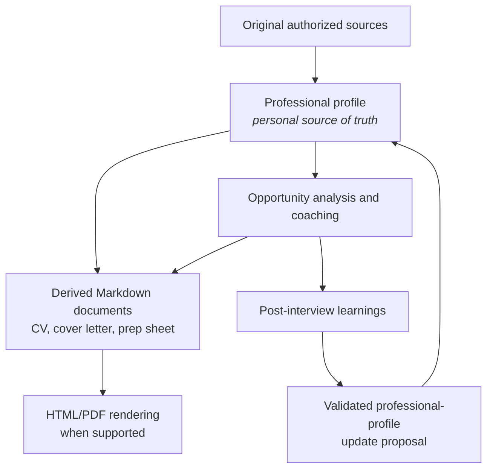
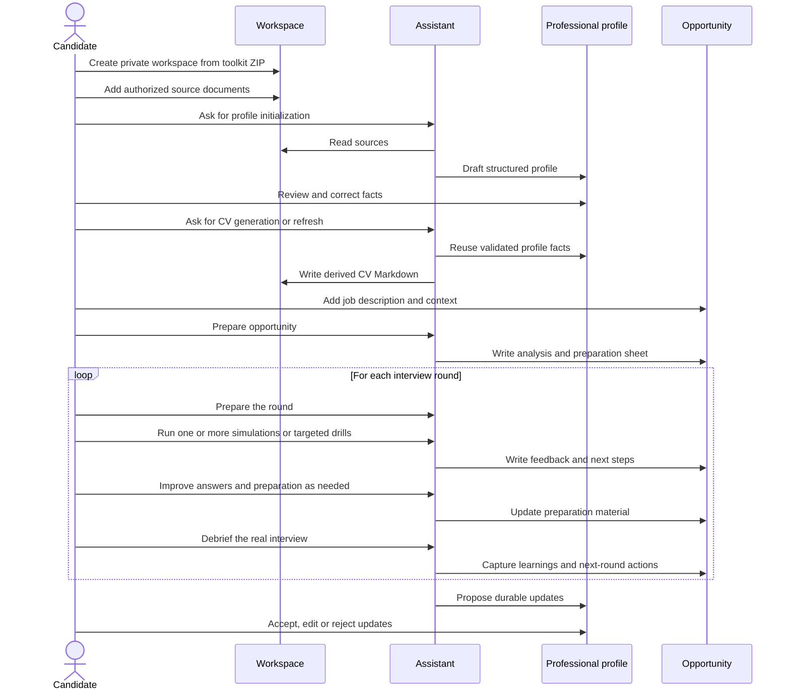

# Document Lifecycle

Modify Markdown sources before regenerating derived output. Never add a new
fact only to a CV, cover letter or interview sheet.

## Candidate Workflow

Version 0.1 does not include a dedicated CV-generation skill yet. CV files are
still treated as derived documents, and any new durable fact should be added to
the professional profile before it becomes part of a CV.
