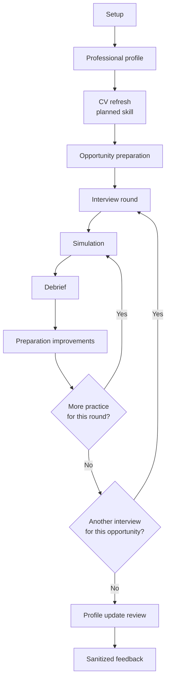

# v0.1 pilot protocol

## Goal

Determine whether the standalone coach and local workspace are useful, understandable and reusable before adding technical complexity.

## Recommended participants

- Technical individual contributors, architects, leads, managers or directors preparing a real interview.
- French-first participants, with some English-interview scenarios where relevant.
- A mix of web-assistant and local-workspace users.

## Suggested journey

1. Choose standalone or workspace mode.
2. Provide only documents the participant is authorized to use.
3. Initialize or provide a professional profile.
4. Generate or refresh a CV if the participant needs one, noting that v0.1 has
   no dedicated CV-generation skill yet.
5. Prepare a real opportunity.
6. Generate and, if possible, use the preparation sheet.
7. Run one or more simulation/debrief/improvement loops for one or more
   interview rounds.
8. Complete a post-interview reflection.
9. Review proposed profile updates.
10. Fill the optional `pilot-feedback.md` form after removing sensitive detail.

## What to observe

- Setup friction and documentation gaps.
- Redundant or intrusive questions.
- Quality and adjustability of strategic messages.
- Realism of simulation and relaunches.
- Specificity and usefulness of the debrief.
- Usefulness of repeated simulation/debrief loops across several interview
  rounds for the same opportunity.
- Usability of the progressive sheet and note area.
- Value and effort of maintaining the professional profile.
- Differences between standalone and workspace modes.
- Whether the CV step feels necessary before opportunity work, and what a
  future CV-generation skill should automate.

## Feedback handling

Participants choose whether to share feedback. Ask for product observations, not their CV, job target, answers or employer details. Record the tested version and AI platform. Consolidate themes in issues or backlog items without copying personal information.
