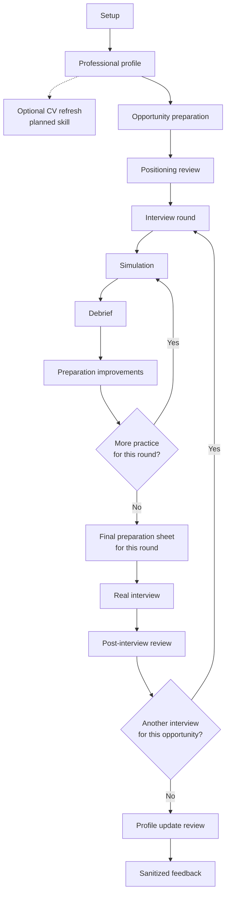

# v0.3 pilot protocol

## Goal

Determine whether the local workspace is useful, understandable and reusable before adding technical complexity.

## Recommended participants

- Technical individual contributors, architects, leads, managers or directors preparing a real interview.
- French-first participants, with some English-interview scenarios where relevant.

## Suggested journey

1. Build and extract the workspace ZIP, then open it in a file-aware AI tool.
2. Provide only documents the participant is authorized to use.
3. Initialize or provide a professional profile.
4. Optionally generate or refresh a CV from the professional profile if the
   participant needs one, noting that v0.3 has no dedicated CV-generation
   skill yet.
5. Give the coach the available sources for a real opportunity and let it
   create the numbered directory and canonical Markdown independently from the
   CV step.
6. Review and validate strategic messages and positioning.
7. Run one or more simulations for one or more interview rounds and persist
   their available artifacts.
8. End the simulation conversation, then run at least one debrief in a fresh
   conversation using only saved artifacts or explicit candidate notes.
9. Generate and, if possible, use the final preparation sheet for the current
   interview round.
10. Complete a post-interview reflection and prepare the next round if needed.
11. Review proposed profile updates.
12. Fill the optional `pilot-feedback.md` form after removing sensitive detail.

## What to observe

- Setup friction and documentation gaps.
- Clarity and reliability of coach-managed opportunity and interview creation.
- Fidelity of `opportunity.md` to the supplied sources and preservation of
  original documents.
- Redundant or intrusive questions.
- Quality and adjustability of strategic messages.
- Whether the candidate can review and validate positioning before simulation.
- Realism of simulation and relaunches.
- Specificity and usefulness of the debrief.
- Ability to produce a trustworthy debrief without the simulation conversation,
  including when only candidate notes are available.
- Usefulness of repeated simulation/debrief loops across several interview
  rounds for the same opportunity.
- Usability of a per-round preparation sheet and note area in the real interview.
- Value and effort of maintaining the professional profile.
- Whether a future CV-generation skill is useful as an independent profile
  output, and what it should automate.

## Feedback handling

Participants choose whether to share feedback. Ask for product observations, not their CV, job target, answers or employer details. Record the tested version and AI platform. Consolidate themes in issues or backlog items without copying personal information.
