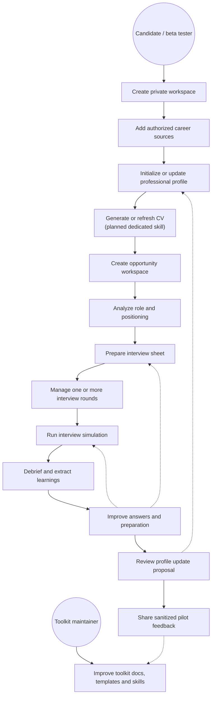

# Use Cases

Career AI Toolkit is organized around a candidate who wants to keep ownership
of career information while using AI for structured preparation. Version 0.1
focuses on the interview coach and local workspace pilot; CV generation is a
planned skill and is represented here as part of the intended workflow.

## Actors

- **Candidate**: owns the workspace, reviews every durable fact and decides
  what can be reused.
- **AI assistant**: reads the workspace, follows toolkit instructions and
  proposes generated or updated documents.
- **Beta tester**: uses the toolkit on a realistic journey and shares sanitized
  product feedback.
- **Toolkit maintainer**: improves generic documentation, templates and skills
  without collecting private career data.

## Main Use Cases

An opportunity can include several interview rounds. A single round can also
need several simulation, debrief and improvement loops before the candidate
feels ready.

## Conversation Scope

Use one assistant conversation per opportunity whenever possible. This keeps
the job description, positioning, interview rounds, simulations, debriefs and
follow-up work in the same context without mixing them with another
application.

If the same opportunity has several interview rounds, keep using the same
conversation while the context is still manageable. Start a new conversation
only when the thread becomes too long, and then point the assistant back to the
opportunity folder and the latest preparation or feedback files.

## Use Case Notes

| Use case | Current v0.1 support | Main output |
| --- | --- | --- |
| Create private workspace | Supported through the built ZIP | Extracted local workspace |
| Initialize professional profile | Supported through coach instructions and templates | `profile/professional-profile.md` |
| Generate CV | Planned; template directory exists but no dedicated skill yet | `cv/*.md`, later HTML/PDF |
| Prepare an opportunity | Supported by the interview coach | Opportunity folder with job description, analysis and preparation sheet |
| Simulate and debrief interviews | Supported by the interview coach | One or more simulation/debrief loops per interview round |
| Update professional profile | Supported as a reviewed proposal | Candidate-approved profile changes |
| Share pilot feedback | Supported through feedback template | Sanitized product feedback |

## Candidate / Beta-Tester Journey

```mermaid
flowchart TD
    start([Start pilot])
    choose{Choose usage mode}
    standalone["Standalone coach<br/>copy Markdown into an AI assistant"]
    workspace["Workspace mode<br/>build and extract private ZIP"]
    configure["Configure workspace<br/>language, preferences, tool context"]
    sources["Add authorized sources<br/>historical CVs, certifications, notes"]
    initProfile["Ask assistant to initialize professional profile"]
    reviewProfile{Candidate approves profile?}
    refineProfile["Refine profile from source evidence"]
    generateCv["Generate or refresh CV<br/>(planned skill; manual/assisted in v0.1)"]
    newOpp["Create one folder per opportunity"]
    addJob["Add job description and useful context"]
    analyze["Analyze fit, risks and strategic messages"]
    prepare["Generate interview preparation sheet"]
    interview["Prepare a specific interview round"]
    simulate["Run mock interview or targeted drills"]
    debrief["Debrief interview and capture learnings"]
    improvePrep["Improve answers, stories and prep material"]
    retrySame{More practice for this interview?}
    durable{Durable profile update?}
    updateProfile["Propose and review profile update"]
    nextInterview{Another interview for this opportunity?}
    nextOpp{Another opportunity?}
    feedback["Fill sanitized pilot feedback"]
    finish([End])

    start --> choose
    choose --> standalone
    choose --> workspace
    workspace --> configure
    standalone --> sources
    configure --> sources
    sources --> initProfile
    initProfile --> reviewProfile
    reviewProfile -- No --> refineProfile --> initProfile
    reviewProfile -- Yes --> generateCv
    generateCv --> newOpp
    newOpp --> addJob --> analyze --> prepare --> interview
    interview --> simulate --> debrief --> improvePrep --> retrySame
    retrySame -- Yes --> simulate
    retrySame -- No --> durable
    durable -- Yes --> updateProfile --> nextInterview
    durable -- No --> nextInterview
    nextInterview -- Yes --> interview
    nextInterview -- No --> nextOpp
    nextOpp -- Yes --> newOpp
    nextOpp -- No --> feedback --> finish
```

The loop matters: interview preparation should improve the opportunity files
first, then the durable professional profile only when the candidate validates
that a learning is reusable beyond one application.
